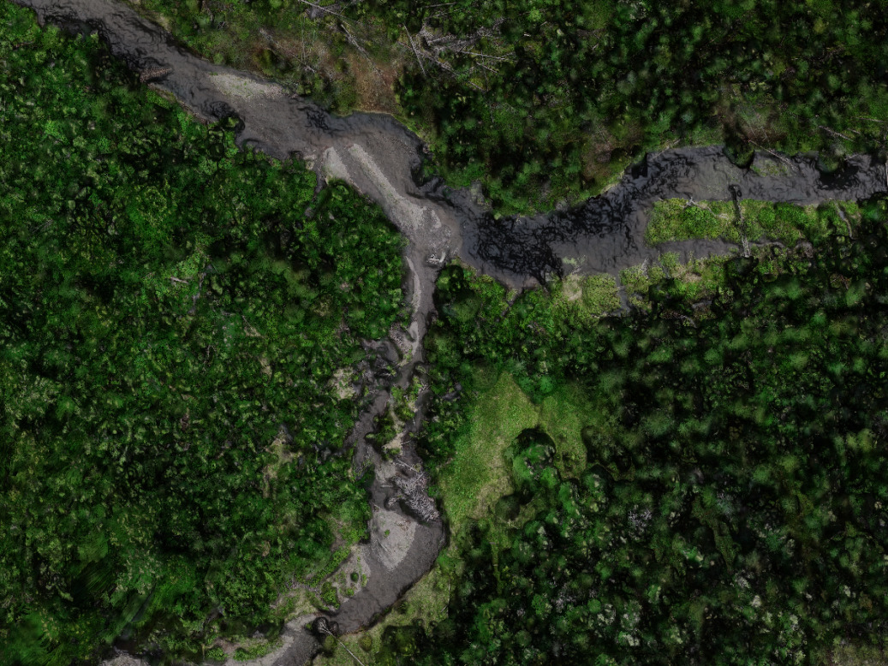
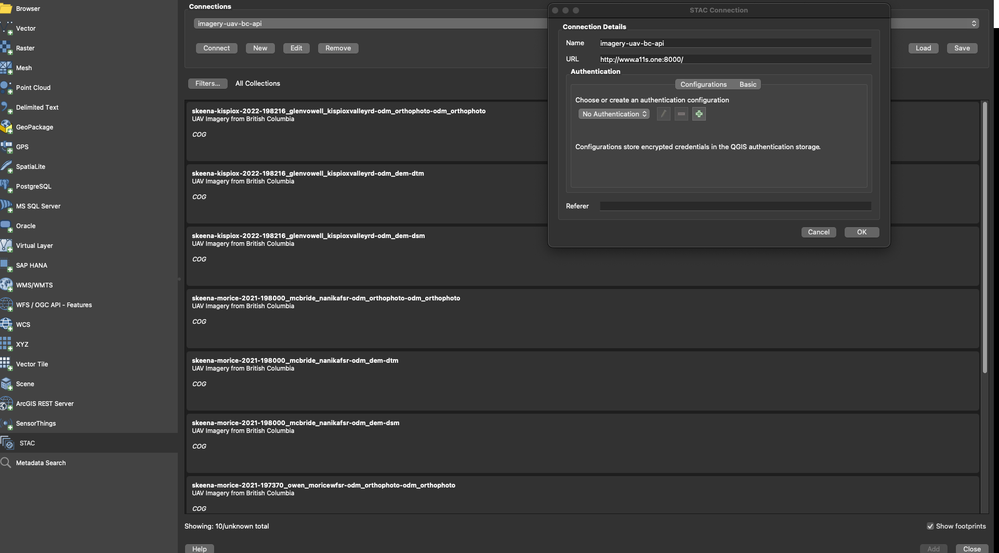
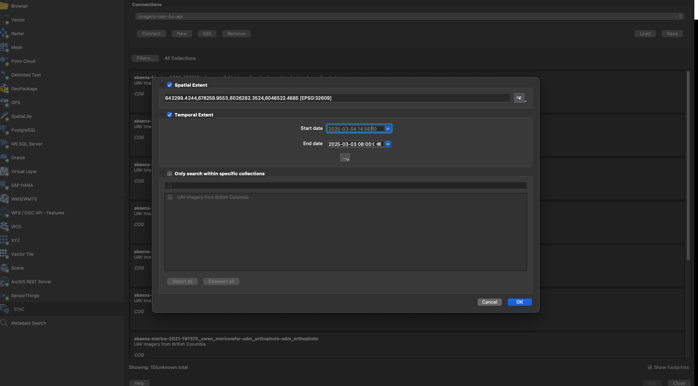

---
output:
  html_document:
    code_folding: hide
---

```{r setup, echo=FALSE, include = TRUE}
knitr::opts_chunk$set(echo=FALSE, message=FALSE, warning=FALSE, dpi=60, out.width = "100%")

```
<!-- README.md is generated from README.Rmd. Please edit that file -->

# stac_uav_bc


The goal of `stac_uav_bc` is to document and serve out our UAV collection for British Columbia.  It is organized by
watershed and can be queried by location and time using our API via the lovely [`rstac` R package](https://brazil-data-cube.github.io/rstac/)
and [QGIS (v3.42+)](https://qgis.org/).  Still a work in progress but currently functioning.

```{r fig, out.width="100%", fig.align="center"}

fpr::fpr_photo_resize_convert("fig/cover.png", path = "fig")

```


```{r, include = T}

staticimports::import()
source('scripts/staticimports.R')
source('scripts/functions.R')
```


```{r api1}

bcbbox <-  as.numeric(
  sf::st_bbox(bcmaps::bc_bound()) |> sf::st_transform(crs = 4326)
)

q <- rstac::stac("http://images.a11s.one/") |>
    rstac::stac_search(collections = "uav-imagery-bc",
                       # bc bounding box
                      bbox = bcbbox
                      # This a bounding box for the [Neexdzi Kwa](https://www.newgraphenvironment.com/restoration_wedzin_kwa_2024/) watershed (aka - the Upper Bulkley River near Houston BC)
                     # bbox = c(-126.77000, 54.08832, -125.88822, 54.68786)
                     ) |>
  rstac::post_request()

r <- q |>
  rstac::items_fetch()
```


<br>


```{r tab-uav-imagery-cap, results="asis", eval=knitr::opts_knit$get("output.format") != "gfm"}
my_caption <- "Drone imagery download and viewer links."

my_tab_caption_rmd(tip_text = " <b>NOTE: Links to viewer current may need to be manually altered in browser to begin with http vs https! This should be resolved soon.</b>")
```

```{r}
tab <- tibble::tibble(url_download = purrr::map_chr(r$features, ~ purrr::pluck(.x, "assets", "image", "href"))) |> 
  dplyr::mutate(stub = stringr::str_replace_all(url_download, "https://dev-imagery-uav-bc.s3.amazonaws.com/", "")) |> 
  tidyr::separate(
    col = stub, 
    into = c("region", "watershed_group", "year", "item", "rest"),
    sep = "/",
    extra = "drop"
  ) |> 
  dplyr::mutate(link_view = ngr::ngr_str_link_url(
    url_base = "https://viewer.a11s.one/?cog=",
    url_resource = url_download, 
    url_resource_path = FALSE,
    # anchor_text= "URL View"
    anchor_text= tools::file_path_sans_ext(basename(url_download))
  ),
  link_download = ngr::ngr_str_link_url(url_base = url_download, anchor_text = url_download)) |> 
  dplyr::select(region, watershed_group, year, item, link_view, link_download)


```


```{r tab-uav-imagery, eval=knitr::opts_knit$get("output.format") != "gfm"}
tab |> 
  my_dt_table(cols_freeze_left = 2, escape = FALSE)
```


As of QGIS 3.42 - ONE can also access stac items (orthoimagery, Digital Surface Models and Digital Terrain Models in our case) directly via
the Data Source Manager. See a blog with details [here](https://www.lutraconsulting.co.uk/blogs/stac-in-qgis).  It looks like this in the 
th `Layer / Data Source Manager` toolbar in QGIS:

```{r}

```

```{r}

```

```{r build, eval = FALSE}
rmarkdown::render("README.Rmd", output_format = "github_document")
rmarkdown::render("README.Rmd", output_format = "html_document", output_file = "index.html")

usethis::use_git_ignore("README.html")

```

