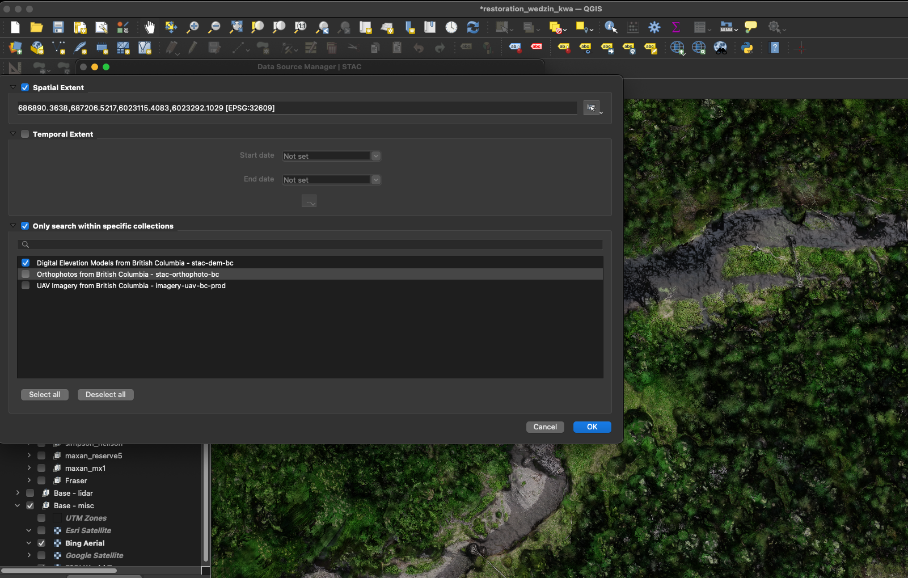

<!-- README.md is generated from README.Rmd. Please edit that file -->

# stac_uav_bc


The goal of `stac_uav_bc` is to document and serve out our UAV collection for British Columbia.  It is organized by
watershed and can be queried by location and time using our API via the lovely [`rstac` R package](https://brazil-data-cube.github.io/rstac/)
and [QGIS (v3.42+)](https://qgis.org/).  Still a work in progress but currently functioning.

```{r fig, out.width="100%", fig.align="center"}

fpr::fpr_photo_resize_convert("fig/cover.png", path = "fig")
knitr::include_graphics("fig/cover.JPG")
```


This a bounding box for the [Neexdzi Kwa](https://www.newgraphenvironment.com/restoration_wedzin_kwa_2024/) watershed (aka - the Upper Bulkley River near Houston BC)

```{r, include = T}
q <- rstac::stac("http://www.a11s.one:8000/") |>
  rstac::stac_search(collections = "uav-imagery-bc",
                     bbox = c(-126.77000, 54.08832, -125.88822, 54.68786)) |>
  rstac::post_request()

q |>
  rstac::items_fetch()
```


```{r api1}
q <- rstac::stac("http://www.a11s.one:8000/") |>
  rstac::stac_search(collections = "uav-imagery-bc",
                     bbox = c(-126.77000, 54.08832, -125.88822, 54.68786)) |>
  rstac::post_request()

q |>
  rstac::items_fetch()
```
Have a look at where to get things

```{r}
q$features[[1]]$assets
```

As of QGIS 3.42 - ONE can also access stac items (orthoimagery, Digital Surface Models and Digital Terrain Models in our case) directly via
the Data Source Manager. See a blog with details [here](https://www.lutraconsulting.co.uk/blogs/stac-in-qgis).  It looks like this in the 
the `Layer / Data Source Manager` toolbar in QGIS:

```{r}

```

```{r}
knitr::include_graphics("fig/a11sone02.png")
```

```{r build, eval = FALSE}
rmarkdown::render("README.Rmd", output_format = "github_document")
rmarkdown::render("README.Rmd", output_format = "html_document")

usethis::use_git_ignore("README.html")

```

