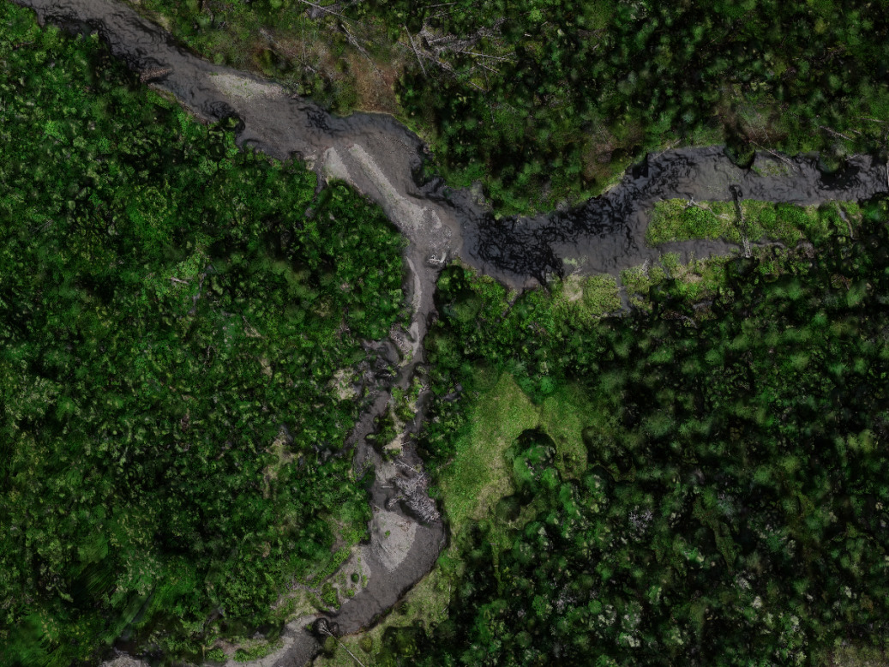
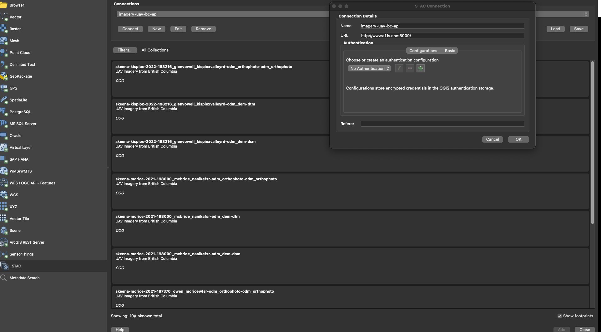

stac_uav_bc
================

<!-- README.md is generated from README.Rmd. Please edit that file -->


The goal of
[`stac_uav_bc`](https://github.com/NewGraphEnvironment/stac_uav_bc) is
to document and serve out UAV imagery collected in British Columbia as a
[SpatioTemporal Asset Catalog (STAC)](https://stacspec.org/) collection,
organized by region / watershed-group / year. Queryable by location via
the [`rstac` R package](https://brazil-data-cube.github.io/rstac/), QGIS
(v3.42+), or any STAC-compliant client. The API endpoint is
<https://images.a11s.one>; an interactive single-COG viewer lives at
<https://viewer.a11s.one>.

To add new imagery to the catalog follow the recipe in
[`scripts/config/README.md`](scripts/config/README.md).

<br>

Sister collections on the same `images.a11s.one` endpoint:

- [`stac_dem_bc`](https://github.com/NewGraphEnvironment/stac_dem_bc) —
  LidarBC digital elevation models (~58k GeoTIFFs)
- [`stac_orthophoto_bc`](https://github.com/NewGraphEnvironment/stac_orthophoto_bc)
  — BC government orthophotos
- [`stac_airphoto_bc`](https://github.com/NewGraphEnvironment/stac_airphoto_bc)
  — historic airphoto thumbnails (1963–2019)

<br>



## Query the collection

Query the `imagery-uav-bc-prod` collection by bounding box. Below: every
UAV item whose footprint intersects the full BC extent.

``` r
# bc bounding box
bcbbox <-  as.numeric(
  sf::st_bbox(bcmaps::bc_bound()) |>
    sf::st_transform(crs = 4326)
)

# use rstac to query the collection
q <- rstac::stac("https://images.a11s.one/") |>
    rstac::stac_search(
      collections = "imagery-uav-bc-prod",
      bbox = bcbbox
    ) |>
  rstac::post_request()

# get details of the items
r <- q |>
  rstac::items_fetch()

saveRDS(r, "data/stac_result.rds")
```

``` r
r <- readRDS("data/stac_result.rds")

# build the table to display the info — split the asset URL into region / watershed_group / year / item
url_bucket <- "https://imagery-uav-bc.s3.amazonaws.com/"
tab <- tibble::tibble(url_download = purrr::map_chr(r$features, ~ purrr::pluck(.x, "assets", "image", "href"))) |>
  dplyr::mutate(stub = stringr::str_replace_all(url_download, url_bucket, "")) |>
  tidyr::separate(
    col = stub,
    into = c("region", "watershed_group", "year", "item", "rest"),
    sep = "/",
    extra = "drop"
  ) |>
  dplyr::mutate(
    link_view = dplyr::case_when(
      !tools::file_path_sans_ext(basename(url_download)) %in% c("dsm", "dtm") ~
        ngr::ngr_str_link_url(
          url_base = "https://viewer.a11s.one/?cog=",
          url_resource = url_download,
          url_resource_path = FALSE,
          anchor_text = tools::file_path_sans_ext(basename(url_download))
        ),
      TRUE ~ "-"
    ),
    link_download = ngr::ngr_str_link_url(url_base = url_download, anchor_text = url_download)
  ) |>
  dplyr::select(region, watershed_group, year, item, link_view, link_download)
```

<br>

Please see <http://www.newgraphenvironment.com/stac_uav_bc> for the
published table of collection links and inline viewer links.

## QGIS Data Source Manager (v3.42+)

QGIS 3.42 added native STAC support — connect directly to the catalog
and filter by the current map view. See [Lutra Consulting’s STAC-in-QGIS
blog post](https://www.lutraconsulting.co.uk/blogs/stac-in-qgis) for a
walk-through.

<div class="figure">


<p class="caption">

Connecting to <https://images.a11s.one>
</p>

</div>

<div class="figure">


<p class="caption">

Using the field of view in QGIS to filter results
</p>

</div>

## Build pipeline

Collection, item, and catalogue creation are documented in three Quarto
notebooks:

- [`stac_create_catalouge.qmd`](stac_create_catalouge.qmd) — root
  catalogue assembly
- [`stac_create_collection.qmd`](stac_create_collection.qmd) —
  collection-level metadata
- [`stac_create_item.qmd`](stac_create_item.qmd) — per-item assembly

The `scripts/` directory holds the orchestration helpers:

| Script | Role |
|----|----|
| `cog_convert.R` | Convert ODM-output GeoTIFFs to Cloud-Optimized GeoTIFFs |
| `odm_process.R` | OpenDroneMap processing (orthomosaic, DSM, DTM generation) |
| `s3_sync.R` | Sync COGs to the `imagery-uav-bc` S3 bucket |
| `s3_index.R`, `s3_map.R` | Index + map S3 contents for ingestion |
| `web.R` | Register STAC items in pgstac via the images.a11s.one HTTP API |
| `config/` | Per-watershed config blobs that drive `web.R` registration |
| `viewer.html` | Standalone viewer-page template for single-COG previews |

Recent infrastructure work — see commit history — added client-side
pagination handling (so very large queries return correctly via
successive `items_next()` fetches) and split S3 uploads into 1000-item
chunks for memory safety.

## Roadmap

- **Per-item timestamps**
  ([\#9](https://github.com/NewGraphEnvironment/stac_uav_bc/issues/9)) —
  add capture-date metadata so the catalog can be time-filtered
  (currently only spatial filtering works for older items).
- **Larger titiler server**
  ([\#8](https://github.com/NewGraphEnvironment/stac_uav_bc/issues/8)) —
  upgrade the tile-rendering host for snappier QGIS / browser preview on
  large rasters.
- **UAV-specific QGIS symbology**
  ([\#5](https://github.com/NewGraphEnvironment/stac_uav_bc/issues/5)) —
  default styling that distinguishes orthomosaic vs DSM vs DTM at a
  glance.
- **Methods section in README**
  ([\#4](https://github.com/NewGraphEnvironment/stac_uav_bc/issues/4)) —
  document the ODM → COG → STAC pipeline end-to-end with the parameters
  that matter (GSD, projection, compression).
- **`stac/` directory cleanup**
  ([\#11](https://github.com/NewGraphEnvironment/stac_uav_bc/issues/11))
  — detect + remove STAC item directories that no longer correspond to a
  source mission.

Browse [open
issues](https://github.com/NewGraphEnvironment/stac_uav_bc/issues) for
the full backlog.

## License

[MIT](LICENSE).
