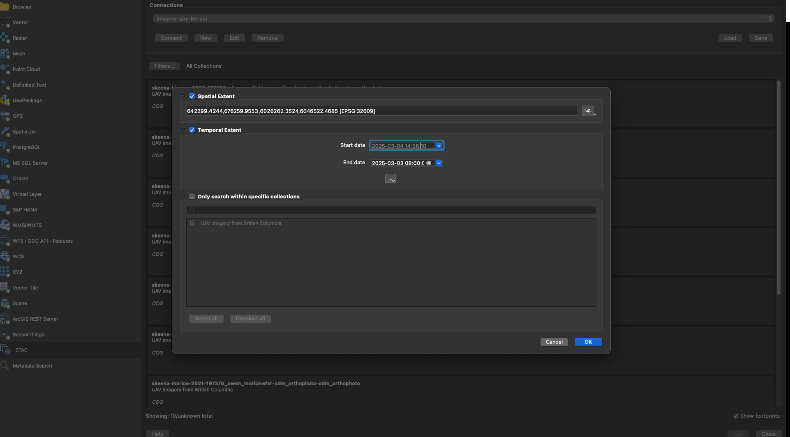

stac_uav_bc
================

<!-- README.md is generated from README.Rmd. Please edit that file -->


The goal of `stac_uav_bc` is to document and serve out our UAV
collection for British Columbia. It is organized by watershed and can be
queried by location and time using our API via the lovely [`rstac` R
package](https://brazil-data-cube.github.io/rstac/) and [QGIS
(v3.42+)](https://qgis.org/). Still a work in progress but currently
functioning at [images.a11s.one](images.a11s.one). See below how to add
STAC items to QGIS.

<br>


``` r
# bc bounding box
bcbbox <-  as.numeric(
  sf::st_bbox(bcmaps::bc_bound()) |> 
    sf::st_transform(crs = 4326)
)
# This a bounding box for the [Neexdzi Kwa](https://www.newgraphenvironment.com/restoration_wedzin_kwa_2024/) watershed (aka - the Upper Bulkley River near Houston BC) bbox = c(-126.77000, 54.08832, -125.88822, 54.68786)

# use rstac to query the collection
q <- rstac::stac("https://images.a11s.one/") |>
    rstac::stac_search(
      # collections = "imagery-uav-bc-dev",
      collections = "imagery-uav-bc-prod",
                      bbox = bcbbox
                      
                     ) |>
  rstac::post_request()

# get deets of the items
r <- q |>
  rstac::items_fetch()
```

``` r
# build the table to display the info
url_bucket <- "https://dev-imagery-uav-bc.s3.amazonaws.com/"
url_bucket <- "https://imagery-uav-bc.s3.amazonaws.com/"
tab <- tibble::tibble(url_download = purrr::map_chr(r$features, ~ purrr::pluck(.x, "assets", "image", "href"))) |> 
  dplyr::mutate(stub = stringr::str_replace_all(url_download, url_bucket, "")) |> 
  tidyr::separate(
    col = stub, 
    into = c("region", "watershed_group", "year", "item", "rest"),
    sep = "/",
    extra = "drop"
  ) |> 
  dplyr::mutate(
    link_view = 
                  dplyr::case_when(
                    !tools::file_path_sans_ext(basename(url_download)) %in% c("dsm", "dtm") ~ 
                      ngr::ngr_str_link_url(
                        url_base = "https://viewer.a11s.one/?cog=",
                        url_resource = url_download, 
                        url_resource_path = FALSE,
                        # anchor_text= "URL View"
                        anchor_text= tools::file_path_sans_ext(basename(url_download))),
                    T ~ "-"),
                        link_download = ngr::ngr_str_link_url(url_base = url_download, anchor_text = url_download)
    )|> 
  dplyr::select(region, watershed_group, year, item, link_view, link_download)
```

<br>

Please see <http://www.newgraphenvironment.com/stac_uav_bc> for
published table of collection links/details.

As of QGIS 3.42 - ONE can also access stac items (orthoimagery, Digital
Surface Models and Digital Terrain Models in our case) directly via the
Data Source Manager. See a blog with details
[here](https://www.lutraconsulting.co.uk/blogs/stac-in-qgis). It looks
like this in the th `Layer / Data Source Manager` toolbar in QGIS:



